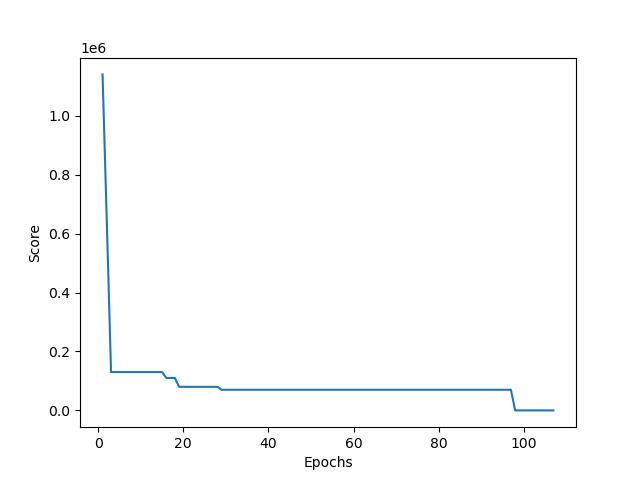

## Schedule Template Creation Using Greedy Search with Simulated Annealing

**Author**: David Everly  
**Language**: Python  
**Version**: 1.1  
**License**: None  

---

## Problem Statement  
The project sponsor described issues with the existing scheduling workflow, which involved manually creating a schedule template and mapping it onto an annual calendar. Conflicting employee and business constraints resulted in excessive meetings and constant revisions. I was asked to automate both the creation of the template and its mapping to the calendar. 
  
# Description  
This program automates the template creation process by accepting a rough draft of a schedule and refining it using predefined global and employee-specific constraints. The system explores the state space using greedy search combined with simulated annealing until no significant improvements are observed. This is followed by local repair and local search phases to resolve any remaining constraint violations. The final template is exported as template.xlsx.

# Theoretical Approach
Scheduling is a classic constraint satisfaction problem. Many algorithms can be applied; however, given the size of the state space, exhaustive search (DFS, BFS) is impractical. Even when weekends are hardcoded, assigning 3 shifts per weekday for 6 weeks results in a state space of: 7<sup>90</sup> states!  

Greedy search offers a faster alternative by selecting the best local option at each step. However, it risks getting stuck in local minima. Simulated Annealing addresses this by occasionally accepting worse states to escape these local optima. My approach combines both methods, followed by local search and repair, to thoroughly analyze and satisfy constraints.

## Table of Contents
- [Installation](#installation)
- [Usage](#usage)
- [Features](#features)
- [Configuration](#configuration)
- [Examples](#examples)
- [Results and Conclusion](#results-and-conclusion)
- [Future Work and Extension](#future-work-and-extension)
- [References](#references)
- [Contributing](#contributing)

# Installation
Dependencies:   
numpy  
pandas  
matplotlib  
openpyxl  

Install using:  
```bash
pip install -r requirements.txt  
```  

# Usage
Program is intended to be run using Unix-like terminal such as Linux, macOS Terminal (untested), or MINGW64 (Git Bash) on Windows.  

Run the script with: 
```bash 
python templater.py 
```  
Or use the provided shell script:    
```bash
./run  
```

# Features  
- Multi-week template generation  
- Custom employee constraints  
- Greedy intialization with annealing  
- Visualization of performance over time  
- Template in .xlsx format  

# Configuration  
- templater.py is the main script which begins initilization and flow orchestration.  
- Employee and constraint definitions are located in helpers.py.  These can be edited, including the addition of new constraints.  If new constraints are added, logic for constraint satisfaction needs to also be added.
- solver.py contains agent search and repair methods. Those wishing to solve using another model can extend solver.py with methods suited for other algorithms.  

# Examples  
Due to the stochastic nature of greedy search and simulated annealing, output will vary between runs. The algorithm continues refining the solution until it reaches a near-optimal state. Below is the progression from a single run:  

Initial state -> 280,004  
Greedy state  -> 70,009  
Repair state  -> 10,005  
Fill state    -> 10,000  
Final Sweep   -> 0  

<details>
<summary>Expand Command Line Output</summary>

```text  
$ ./run
Total required shifts over 6 weeks: 99 (Total Hours: 1188)
Total available hours from staff: 1560.0
✅ Staff-hour capacity seems sufficient.
Week: 0
Day 0: Josh,Britt | Night: Ashley
Day 1: Britt,UNFILLED | Night: Megan
Day 2: Kati,UNFILLED | Night: Liz
Day 3: Josh,Britt | Night: Ashley
Day 4: Josh,UNFILLED | Night: Ashley
Day 5: David,Kati | Night: Liz
Day 6: David,Kati | Night: Liz
Week: 1
Day 0: Kati,Britt | Night: Liz
Day 1: Britt,UNFILLED | Night: Josh
Day 2: David,Megan | Night: Ashley
Day 3: Kati,Britt | Night: Liz
Day 4: Kati,UNFILLED | Night: Liz
Day 5: Megan,UNFILLED | Night: Ashley
Day 6: Megan,UNFILLED | Night: Ashley
Week: 2
Day 0: Megan,Britt | Night: Ashley
Day 1: Britt,UNFILLED | Night: Megan
Day 2: Josh,UNFILLED | Night: Liz
Day 3: Megan,Britt | Night: Ashley
Day 4: Megan,UNFILLED | Night: Ashley
Day 5: David,Josh | Night: Liz
Day 6: David,Josh | Night: Liz
Week: 3
Day 0: Josh,Megan | Night: Liz
Day 1: Kati,UNFILLED | Night: Megan
Day 2: David,Britt | Night: Ashley
Day 3: Josh,Megan | Night: Liz
Day 4: Josh,UNFILLED | Night: Liz
Day 5: Britt,UNFILLED | Night: Ashley
Day 6: Britt,UNFILLED | Night: Ashley
Week: 4
Day 0: Britt,Kati | Night: Ashley
Day 1: Kati,UNFILLED | Night: Josh
Day 2: Megan,UNFILLED | Night: Liz
Day 3: Britt,Josh | Night: Ashley
Day 4: Britt,UNFILLED | Night: Ashley
Day 5: David,Megan | Night: Liz
Day 6: David,Megan | Night: Liz
Week: 5
Day 0: Megan,Britt | Night: Liz
Day 1: Britt,UNFILLED | Night: Megan
Day 2: David,Josh | Night: Ashley
Day 3: Megan,Britt | Night: Liz
Day 4: Megan,UNFILLED | Night: Liz
Day 5: Josh,UNFILLED | Night: Ashley
Day 6: Josh,UNFILLED | Night: Ashley

Starting Score: 1640011
Starting greedy initialization…
-----------------Greedy Phase Complete--------------
Greedy best state
Week: 0
Day 0: Megan,Britt | Night: Ashley
Day 1: Britt,UNFILLED | Night: Megan
Day 2: Kati,Josh | Night: Liz
Day 3: Josh,Megan | Night: Ashley
Day 4: Josh,UNFILLED | Night: Ashley
Day 5: David,Kati | Night: Liz
Day 6: David,Kati | Night: Liz
Week: 1
Day 0: Kati,Britt | Night: Liz
Day 1: Britt,UNFILLED | Night: Josh
Day 2: David,Megan | Night: Ashley
Day 3: Kati,Britt | Night: Liz
Day 4: Kati,UNFILLED | Night: Liz
Day 5: Megan,UNFILLED | Night: Ashley
Day 6: Megan,UNFILLED | Night: Ashley
Week: 2
Day 0: Megan,Britt | Night: Ashley
Day 1: Britt,UNFILLED | Night: Josh
Day 2: Josh,Kati | Night: Liz
Day 3: Megan,Britt | Night: Ashley
Day 4: Megan,UNFILLED | Night: Ashley
Day 5: David,Josh | Night: Liz
Day 6: David,Josh | Night: Liz
Week: 3
Day 0: Britt,Josh | Night: Liz
Day 1: Britt,UNFILLED | Night: Megan
Day 2: David,Kati | Night: Ashley
Day 3: Josh,Megan | Night: Liz
Day 4: Megan,UNFILLED | Night: Liz
Day 5: Britt,UNFILLED | Night: Ashley
Day 6: Britt,UNFILLED | Night: Ashley
Week: 4
Day 0: Britt,Kati | Night: Ashley
Day 1: Kati,UNFILLED | Night: Megan
Day 2: Megan,Kati | Night: Liz
Day 3: Britt,Josh | Night: Ashley
Day 4: Britt,UNFILLED | Night: Ashley
Day 5: David,Megan | Night: Liz
Day 6: David,Megan | Night: Liz
Week: 5
Day 0: Josh,Britt | Night: Liz
Day 1: Britt,UNFILLED | Night: Josh
Day 2: David,Megan | Night: Ashley
Day 3: Josh,Megan | Night: Liz
Day 4: Britt,UNFILLED | Night: Liz
Day 5: Josh,UNFILLED | Night: Ashley
Day 6: Josh,UNFILLED | Night: Ashley

Score: 60015
Starting post-Greedy repair…
Repair: swapped Megan@000 with Kati@020 60015→50014
Repair: swapped Britt@231 with Josh@030 50014→30021
Repair: swapped Josh@021 with Kati@000 30021→30019
Repair: swapped Britt@030 with Josh@040 30019→30018
Repair: swapped Josh@220 with David@120 30018→20015
Repair: swapped Josh@212 with Liz@222 20015→20014
Repair: swapped Britt@310 with Josh@231 20014→20012
Repair: swapped David@320 with Megan@230 20012→10019
Repair: swapped David@230 with Kati@021 10019→10014
Repair: swapped Britt@231 with Megan@240 10014→10013
Repair: swapped Megan@312 with Liz@302 10013→10011
Repair: swapped Josh@330 with Kati@130 10011→10010
Repair: swapped Britt@131 with Kati@140 10010→10009
Repair: swapped Josh@500 with Kati@230 10009→12
Repair: swapped Josh@512 with Ashley@522 12→11
Finished repairs in 16 No further repairs after 16 epochs
After Repair state
Week: 0
Day 0: Josh,Britt | Night: Ashley
Day 1: Britt,UNFILLED | Night: Megan
Day 2: Megan,David | Night: Liz
Day 3: Josh,Megan | Night: Ashley
Day 4: Britt,UNFILLED | Night: Ashley
Day 5: David,Kati | Night: Liz
Day 6: David,Kati | Night: Liz
Week: 1
Day 0: Kati,Britt | Night: Liz
Day 1: Britt,UNFILLED | Night: Josh
Day 2: Josh,Megan | Night: Ashley
Day 3: Josh,Kati | Night: Liz
Day 4: Britt,UNFILLED | Night: Liz
Day 5: Megan,UNFILLED | Night: Ashley
Day 6: Megan,UNFILLED | Night: Ashley
Week: 2
Day 0: Megan,Britt | Night: Ashley
Day 1: Britt,UNFILLED | Night: Liz
Day 2: David,Kati | Night: Josh
Day 3: Josh,Megan | Night: Ashley
Day 4: Britt,UNFILLED | Night: Ashley
Day 5: David,Josh | Night: Liz
Day 6: David,Josh | Night: Liz
Week: 3
Day 0: Britt,Josh | Night: Megan
Day 1: Josh,UNFILLED | Night: Liz
Day 2: Megan,Kati | Night: Ashley
Day 3: Kati,Megan | Night: Liz
Day 4: Megan,UNFILLED | Night: Liz
Day 5: Britt,UNFILLED | Night: Ashley
Day 6: Britt,UNFILLED | Night: Ashley
Week: 4
Day 0: Britt,Kati | Night: Ashley
Day 1: Kati,UNFILLED | Night: Megan
Day 2: Megan,Kati | Night: Liz
Day 3: Britt,Josh | Night: Ashley
Day 4: Britt,UNFILLED | Night: Ashley
Day 5: David,Megan | Night: Liz
Day 6: David,Megan | Night: Liz
Week: 5
Day 0: Kati,Britt | Night: Liz
Day 1: Britt,UNFILLED | Night: Ashley
Day 2: David,Megan | Night: Josh
Day 3: Josh,Megan | Night: Liz
Day 4: Britt,UNFILLED | Night: Liz
Day 5: Josh,UNFILLED | Night: Ashley
Day 6: Josh,UNFILLED | Night: Ashley

Score: 11
-----------------Repair Phase Complete--------------     
Filling Minimums…
After Filling state
Week: 0
Day 0: Josh,Britt | Night: Ashley
Day 1: Britt,UNFILLED | Night: Megan
Day 2: Megan,David | Night: Liz
Day 3: Josh,Megan | Night: Ashley
Day 4: Britt,UNFILLED | Night: Ashley
Day 5: David,Kati | Night: Liz
Day 6: David,Kati | Night: Liz
Week: 1
Day 0: Kati,Britt | Night: Liz
Day 1: Britt,UNFILLED | Night: Josh
Day 2: Josh,Megan | Night: Ashley
Day 3: Josh,Kati | Night: Liz
Day 4: Britt,UNFILLED | Night: Liz
Day 5: Megan,UNFILLED | Night: Ashley
Day 6: Megan,UNFILLED | Night: Ashley
Week: 2
Day 0: Megan,Britt | Night: Ashley
Day 1: Britt,UNFILLED | Night: Liz
Day 2: David,Kati | Night: Josh
Day 3: Josh,Megan | Night: Ashley
Day 4: Britt,UNFILLED | Night: Ashley
Day 5: David,Josh | Night: Liz
Day 6: David,Josh | Night: Liz
Week: 3
Day 0: Britt,Josh | Night: Megan
Day 1: Josh,UNFILLED | Night: Liz
Day 2: Megan,Kati | Night: Ashley
Day 3: Kati,Megan | Night: Liz
Day 4: Megan,UNFILLED | Night: Liz
Day 5: Britt,UNFILLED | Night: Ashley
Day 6: Britt,UNFILLED | Night: Ashley
Week: 4
Day 0: Britt,Kati | Night: Ashley
Day 1: Kati,UNFILLED | Night: Megan
Day 2: Megan,Kati | Night: Liz
Day 3: Britt,Josh | Night: Ashley
Day 4: Britt,UNFILLED | Night: Ashley
Day 5: David,Megan | Night: Liz
Day 6: David,Megan | Night: Liz
Week: 5
Day 0: Kati,Britt | Night: Liz
Day 1: Britt,UNFILLED | Night: Ashley
Day 2: David,Megan | Night: Josh
Day 3: Josh,Megan | Night: Liz
Day 4: Britt,UNFILLED | Night: Liz
Day 5: Josh,UNFILLED | Night: Ashley
Day 6: Josh,UNFILLED | Night: Ashley

Score: 6
-----------------Fill Phase Complete--------------       
Final Sweep…
After Sweep state
Week: 0
Day 0: Josh,Britt | Night: Ashley
Day 1: Britt,Kati | Night: Megan
Day 2: Megan,David | Night: Liz
Day 3: Josh,Megan | Night: Ashley
Day 4: Britt,Josh | Night: Ashley
Day 5: David,Kati | Night: Liz
Day 6: David,Kati | Night: Liz
Week: 1
Day 0: Kati,Britt | Night: Liz
Day 1: Britt,UNFILLED | Night: Josh
Day 2: Josh,Megan | Night: Ashley
Day 3: Josh,Kati | Night: Liz
Day 4: Britt,Kati | Night: Liz
Day 5: Megan,UNFILLED | Night: Ashley
Day 6: Megan,UNFILLED | Night: Ashley
Week: 2
Day 0: Megan,Britt | Night: Ashley
Day 1: Britt,Kati | Night: Liz
Day 2: David,Kati | Night: Josh
Day 3: Josh,Megan | Night: Ashley
Day 4: Britt,Kati | Night: Ashley
Day 5: David,Josh | Night: Liz
Day 6: David,Josh | Night: Liz
Week: 3
Day 0: Britt,Josh | Night: Megan
Day 1: Josh,Kati | Night: Liz
Day 2: Megan,Kati | Night: Ashley
Day 3: Kati,Megan | Night: Liz
Day 4: Megan,UNFILLED | Night: Liz
Day 5: Britt,UNFILLED | Night: Ashley
Day 6: Britt,UNFILLED | Night: Ashley
Week: 4
Day 0: Britt,Kati | Night: Ashley
Day 1: Kati,UNFILLED | Night: Megan
Day 2: Megan,Kati | Night: Liz
Day 3: Britt,Josh | Night: Ashley
Day 4: Britt,Josh | Night: Ashley
Day 5: David,Megan | Night: Liz
Day 6: David,Megan | Night: Liz
Week: 5
Day 0: Kati,Britt | Night: Liz
Day 1: Britt,Kati | Night: Ashley
Day 2: David,Megan | Night: Josh
Day 3: Josh,Megan | Night: Liz
Day 4: Britt,Kati | Night: Liz
Day 5: Josh,UNFILLED | Night: Ashley
Day 6: Josh,UNFILLED | Night: Ashley

Score: 6
-----------------Template Complete--------------
Final Score: 6

--- Final Best Solution ---
Week: 0
Day 0: Josh,Britt | Night: Ashley
Day 1: Britt,Kati | Night: Megan
Day 2: Megan,David | Night: Liz
Day 3: Josh,Megan | Night: Ashley
Day 4: Britt,Josh | Night: Ashley
Day 5: David,Kati | Night: Liz
Day 6: David,Kati | Night: Liz
Week: 1
Day 0: Kati,Britt | Night: Liz
Day 1: Britt,UNFILLED | Night: Josh
Day 2: Josh,Megan | Night: Ashley
Day 3: Josh,Kati | Night: Liz
Day 4: Britt,Kati | Night: Liz
Day 5: Megan,UNFILLED | Night: Ashley
Day 6: Megan,UNFILLED | Night: Ashley
Week: 2
Day 0: Megan,Britt | Night: Ashley
Day 1: Britt,Kati | Night: Liz
Day 2: David,Kati | Night: Josh
Day 3: Josh,Megan | Night: Ashley
Day 4: Britt,Kati | Night: Ashley
Day 5: David,Josh | Night: Liz
Day 6: David,Josh | Night: Liz
Week: 3
Day 0: Britt,Josh | Night: Megan
Day 1: Josh,Kati | Night: Liz
Day 2: Megan,Kati | Night: Ashley
Day 3: Kati,Megan | Night: Liz
Day 4: Megan,UNFILLED | Night: Liz
Day 5: Britt,UNFILLED | Night: Ashley
Day 6: Britt,UNFILLED | Night: Ashley
Week: 4
Day 0: Britt,Kati | Night: Ashley
Day 1: Kati,UNFILLED | Night: Megan
Day 2: Megan,Kati | Night: Liz
Day 3: Britt,Josh | Night: Ashley
Day 4: Britt,Josh | Night: Ashley
Day 5: David,Megan | Night: Liz
Day 6: David,Megan | Night: Liz
Week: 5
Day 0: Kati,Britt | Night: Liz
Day 1: Britt,Kati | Night: Ashley
Day 2: David,Megan | Night: Josh
Day 3: Josh,Megan | Night: Liz
Day 4: Britt,Kati | Night: Liz
Day 5: Josh,UNFILLED | Night: Ashley
Day 6: Josh,UNFILLED | Night: Ashley

Kati relative violation Minimum Rest on 011
Liz relative violation Minimum Rest on 212
Kati relative violation Minimum Rest on 241
Megan relative violation Minimum Rest on 302
Liz relative violation Minimum Rest on 312
Ashley relative violation Minimum Rest on 512
Global Abs Violation: 0
Global Rel Violation: 0
Staff Abs Violation: 0
Staff Rel Violation: 6
Final Score: 6
UNFILLED: 108 hrs worked total
David: 108 hrs worked total
Josh: 216 hrs worked total
Kati: 216 hrs worked total
Britt: 216 hrs worked total
Liz: 216 hrs worked total
Megan: 216 hrs worked total
Ashley: 216 hrs worked total
UNFILLED:
  Weeks 0-1: 36 hrs
  Weeks 2-3: 36 hrs
  Weeks 4-5: 36 hrs
David:
  Weeks 0-1: 36 hrs
  Weeks 2-3: 36 hrs
  Weeks 4-5: 36 hrs
Josh:
  Weeks 0-1: 72 hrs
  Weeks 2-3: 72 hrs
  Weeks 4-5: 72 hrs
Kati:
  Weeks 0-1: 72 hrs
  Weeks 2-3: 72 hrs
  Weeks 4-5: 72 hrs
Britt:
  Weeks 0-1: 72 hrs
  Weeks 2-3: 72 hrs
  Weeks 4-5: 72 hrs
Liz:
  Weeks 0-1: 72 hrs
  Weeks 2-3: 72 hrs
  Weeks 4-5: 72 hrs
Megan:
  Weeks 0-1: 72 hrs
  Weeks 2-3: 72 hrs
  Weeks 4-5: 72 hrs
Ashley:
  Weeks 0-1: 72 hrs
  Weeks 2-3: 72 hrs
  Weeks 4-5: 72 hrs
  ```
</details> ```  

 

[📄 View Final Template (Google Sheets)](https://docs.google.com/spreadsheets/d/1pQ2ikx7xCO3GEW18450oJszRIT6FUK3cu3nQw0aWBz8/edit?usp=sharing)


# Results and Conclusion
The model reliably generates schedule templates that satisfy both global and employee-level constraints in most runs. This significantly reduces the effort compared to manual schedule creation. Any dissatisfaction with the output can typically be resolved by encoding additional constraints or adjusting the scoring logic accordingly.

# Future Work and Extension  
This solution addresses one half of the sponsor’s problem—template creation. The other half involved mapping the template to an annual calendar. I have already created a separate solution for that task (see the "Scheduler" on GitHub). A natural next step would be to integrate both tools into a unified workflow.

# References  

No external sources were used. However, LLM queries assisted with architectural design and debugging.  

# Contributing  
No external parties contibuted to this project.  